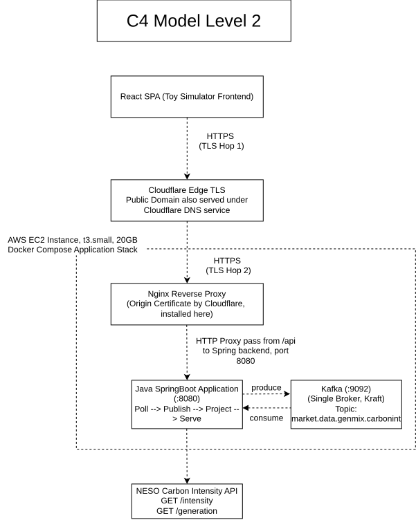
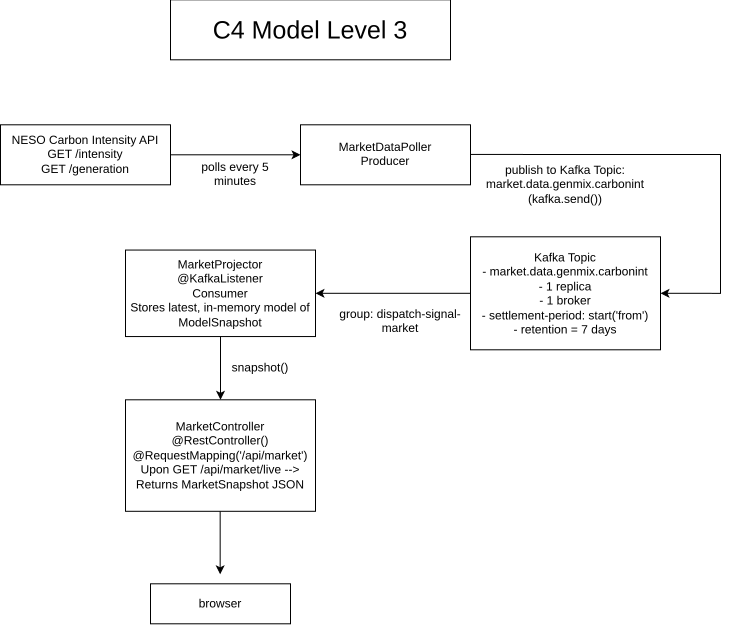

# Simple Energy Market Game Simulator


Just a Energy Market simulator I made, as an entrypoint into understanding the European Energy Market and how something as `seemingly` simple and ubiquitous such as energy, is actually a product of a long, painstaking and storied journey being made possible by various key drivers of our global infrastructure, and economy. It is my fist step to better understanding the energy market as a Software Engineer.

Here is the link:
https://simple-energy-market-simulator-euro-one.vercel.app/

---

## My Key Reflective Points (Split into chapters)
---

1. **Spark spread**, and how it is a key measuring point for the economic viability of running a given gas power plant, hence a key determinant for dispatch.

2. **Efficiency & economic viability**, and how plant efficiency is important to ensuring its competitiveness in the energy market. This is all the more pertinent nowadays, as renewable power facilities entail less variable costs upfront (specifically from consuming fuel, paying for carbon emissions).

3. **The merit order**, and it being akin to a structured ledger ranking power facilities based on their bids in a pay-as-clear energy auction. The order is cheapest bid first, until the demand is satisfied. This also lends to the Merit Order Effect, which is an event where wholesale electricity prices go down due to the onset of more renewable power in the market - pushing conventional power plants of higher marginal cost (and thus incurring need for higher bids) slowly out of the auction.


4. **Price Auctions at the European Energy Market**, and how the pay-as-clear auction works in theory, within the scope of meeting a singular demand value of electicity, and considering a fleet of different power generation facilities.


5. **Market power & strategic bidding**, and how in such auctions it is never necessarily the case of just placing a bid that = marginal cost. Instead, there are many different strategis to bidding, including some interesting case studies.


6. **Hedging**, and how it serves as a means to guarantee certainty, stability against spot price volatility. Included is a key graphical visualisation of the net profits of a particular producer, in a hedged vs unhedged position.

7. **Carbon pricing**, and how it discourages the dispatch of conventional less environmentally friendly power plants. This comes as incurred carbon tax / Cap-and-Trade system resort the merit order, thus reducing electricity prices and giving precedence to more renewable energy sources. One key entity is the EU ETS.


8. **Negative prices**, and how per-MWh subsidies can push the marginal
   offer below zero. Quite an interesting event that has been on the rise with the energy transition.

---

## How the simulation works

This project is a **toy learning simulator**, rather than an attempt to reproduce the full systems that operate the European Day-Ahead or Intraday electricity markets.

The frontend provides a 3D representation of a simplified generation fleet containing technologies such as wind, solar and thermal power plants. Their economic behaviour changes in response to user-controlled or simulated market variables such as:

* electricity price;
* fuel price;
* carbon price;
* renewable availability;
* electricity demand; and
* submitted offer prices.

The simulator uses two main economic views.

### Price-taking scenarios

In several chapters, the electricity market price is treated as an **external price signal** that has already been determined elsewhere.

Thus:

> Given this electricity price, which plants are economically viable to operate, and what happens to their margins when fuel prices, carbon prices, efficiency or renewable availability change?

These chapters therefore focus on the economics of generation and dispatch. The simulated price can move over time to demonstrate changing market conditions. However, this should not be interpreted specifically as an Intraday market simulation. In reality, a tradable price signal could originate from Day-Ahead, Intraday, balancing or other power markets.

### Auction scenarios

Other chapters, particularly those covering Day-Ahead clearing, strategic bidding and negative prices, use a simplified **pay-as-clear auction**.

User-controlled sliders and automated trends change the simulation inputs. As new developments happen, event logs pop up with brief explanations, saved to a log at the right of the dashboard.


Within each chapter, we sliders to play with that control - power price, gas price, carbon
price, wind availability, demand, strategic bid...etc.
---


### Backend Architecture

Drawn with the [C4 model](https://c4model.com): Level 2 shows the deployable
containers and how they talk to each other; Level 3 zooms into the Spring
container to follow one reading from NESO to the browser.

#### Level 2 — Containers



#### Level 3 — Spring components: the streaming flow



The backend is deliberately small: a **poll → publish → project → serve**
pipeline. Every five minutes a scheduled producer pulls the live GB generation
mix and carbon intensity from NESO's Carbon Intensity API, deserialises and
validates the payload at the boundary, and publishes a `MarketData` event to a
single-partition Kafka topic. A consumer projects the latest event into an
in-memory read model, and `GET /api/market/live` serves that as a
`MarketSnapshot`. Kafka sits between producer and consumer so an upstream
outage never takes the endpoint down — it keeps serving the last good reading.

#### Data contracts

Data crosses three boundaries, each with its own agreed shape and a single
owner. Boundary 1 is the only place untrusted data enters, so that is where it
is validated: Jakarta Bean Validation on the wire DTOs (Java's equivalent of a
zod or pydantic schema), plus one cross-field rule that annotations cannot
express. Boundary 2 is protected by the records' compact constructors, so an
invalid event cannot be constructed on either side of Kafka.

```text
Boundary 1 --> NESO Carbon Intensity API --> Spring backend   (wire DTOs, validated on arrival)

CarbonIntensityApi  (ingestion.carbon; sealed marker interface)
Permits:
  |_ GenerationMix   <-- GET /generation
  |_ Intensity       <-- GET /intensity

GenerationMix  (ingestion.carbon)
  |_ data : Data   (@NotNull, @Valid)
      |_ from          : String        (@NotBlank)
      |_ to            : String        (@NotBlank)
      |_ generationmix : List<Entry>   (@NotEmpty, each @Valid)

Entry
  |_ fuel : String   (@NotBlank)
  |_ perc : double   (@DecimalMin("0.0"), @DecimalMax("100.0"))

Intensity  (ingestion.carbon)
  |_ data : List<IntensityData>   (@NotEmpty, each @Valid)   <-- NESO wraps this one in an array
      |_ from      : String    (@NotBlank)
      |_ to        : String    (@NotBlank)
      |_ intensity : Reading   (@NotNull, @Valid)

Reading
  |_ forecast : Integer   nullable
  |_ actual   : Integer   nullable until the settlement period closes
  |_ index    : String

Cross-field rule, enforced in code because annotations cannot express it:
  sum(perc) across the generation mix must be within 1% of 100

              |  CarbonIntensityClient maps wire DTO --> MarketData
              |  (anti-corruption layer: NESO's shape stops here)
              v

Boundary 2 --> Kafka event (poller -> topic -> projector)   (message schema)

MarketData  (ingestion.domain_contract)   invariants in the compact constructor:
  |_ from                       : String            not null, not blank
  |_ to                         : String            not null, not blank
  |_ mix                        : List<FuelShare>   not null; defensively copied, immutable
  |_ carbonIntensityGramsPerKwh : Integer?          null, or >= 0
  |_ carbonIntensityIndex       : String?           nullable

FuelShare  (ingestion.domain_contract)   compact constructor:
  |_ fuel : String   not null, not blank
  |_ perc : double   0.0 .. 100.0, NaN rejected

The same constructors run when Jackson rebuilds the record on the consumer
side, so a malformed message can never become a MarketData either.

              |  MarketProjector.snapshot() projects the latest event
              v

Boundary 3 --> API response, backend -> browser   (serving contract)

MarketSnapshot  (dto)
  |_ at         : java.time.Instant
  |_ settlement : String?                "{from} -> {to}"  -- the spaces are part of
                                         the contract: market.ts splits on " -> "
  |_ feeds      : Map<String, FeedView>  keys: generationMix | carbonIntensity
                                               | powerPrice | fuelPrices

FeedView  (dto)
  |_ status   : Status     enum, sent by name: AVAILABLE | NOT_WIRED | UNAVAILABLE
  |_ source   : String     e.g. "Carbon Intensity API"
  |_ endpoint : String
  |_ region   : String
  |_ access   : String     label from the FeedAccess enum, shown verbatim
  |_ note     : String?    why unavailable, when it is
  |_ data     : FeedData?  null unless status is AVAILABLE

FeedAccess  (dto enum; only its label crosses the wire)
  |_ FREE_NO_KEY            --> "Free API, no registered key required"
  |_ FREE_API_KEY_REQUIRED  --> "Free API, registered key is required"
  |_ PAID                   --> "A paid API endpoint. Need to pay and register to use"

FeedData  (dto; sealed interface -- a value is ONE of these, never both)
Permits:
  |_ FeedData.GenerationMix    { shares      : Map<String, Double> }   fractions 0..1
  |_ FeedData.CarbonIntensity  { gramsPerKwh : Integer, intensityIndex : String }

Mirrored in frontend/src/market.ts as TypeScript types.
```

The full walkthrough — the Level 1 context view, plain-text versions of these
diagrams, and the Kafka design decisions (why one partition, why a compacted
topic is the natural next step) — is in
[docs/architecture/ARCHITECTURE.md](docs/architecture/ARCHITECTURE.md). The
diagrams are `.drawio.svg` files: they render as normal images here and open
directly in [diagrams.net](https://app.diagrams.net) for editing.

## External data sources

The backend is a small ETL pipeline: poll --> publish to Kafka --> project into a
read model --> serve `GET /api/market/live`. The frontend shows every feed with its
provider, endpoint and cost, so it is always clear what is real and what is
simulated.

| Feed | Source | Endpoint | Region | Cost | Status |
|---|---|---|---|---|---|
| Generation mix | Carbon Intensity API | `api.carbonintensity.org.uk/generation` | Great Britain | Free, no key | **Live** |
| Carbon intensity | Carbon Intensity API | `api.carbonintensity.org.uk/intensity` | Great Britain | Free, no key | **Live** |
| Day-ahead / system power price | Elexon BMRS / ENTSO-E Transparency Platform | `bmrs.elexon.co.uk` / `transparency.entsoe.eu` | GB / EU bidding zones | Free, needs an API key | Not wired yet |
| Fuel & carbon prices | Commercial market data (ICE, EEX and similar) | Subscription data terminals | NBP/TTF gas, API2 coal, EU ETS carbon | Paid | No free feed - simulated |

Polled every 5 minutes; the upstream feed itself only updates every half hour, so
polling harder just wastes calls.

However, here are some caveats:

- **Carbon intensity is display-only.** The live gCO₂/kWh reading is shown for
  context, but the carbon *price* driving the merit order is still the slider. I am still on the prowl for a free feed regarding EU/ETS prices.
  
- **Gas, coal and carbon prices have no free live source.** They are simulated in
  the frontend. The pipeline is wired for them regardless, so swapping in a real
  feed later can be done.

---

## Hosted on

| Part | Where |
|---|---|
| Frontend | **Vercel** — [simple-energy-market-simulator-euro-one.vercel.app](https://simple-energy-market-simulator-euro-one.vercel.app/) |
| Backend | **AWS EC2** (`t3.small`) + Docker Compose — nginx behind Cloudflare, SSL mode Full (strict) — [emseuro.millerman117.com](https://emseuro.millerman117.com/healthz) |

The frontend runs entirely standalone: the whole simulation - merit order,
clearing price, hedging, cap-and-trade - is computed in the browser.

Live site is fully usable with the backend offline. The backend only adds the live GB
feeds on top.

## How to run

**Frontend only** (enough for everything except the live feeds):

```bash
cd frontend
npm install
npm run dev            # http://localhost:5173
```

**With the backend** (adds the live GB generation mix and carbon intensity):

```bash
docker compose up -d   # Kafka (KRaft, no Zookeeper)
./mvnw spring-boot:run # http://localhost:8080
```

Then in another terminal run the frontend as above - Vite proxies `/api` to
`localhost:8080` in dev, so no configuration is needed.

Postgres is only used by the AI analyst, which is currently disabled; the app
boots and serves the live feeds without it.

To serve the built frontend from Spring instead of Vite:

```bash
cd frontend && npm run build:spring   # builds, then copies into src/main/resources/static
```

---

## Tech stack

- **Frontend / lesson engine:** TypeScript + React (declarative lessons: plants,
  controls, and triggers as data)
- **Simulation core:** a shared merit-order clearing engine
- **Visualisation (in progress):** a graphical three.js front-end to show plants,
  bidding, and the clearing price.
